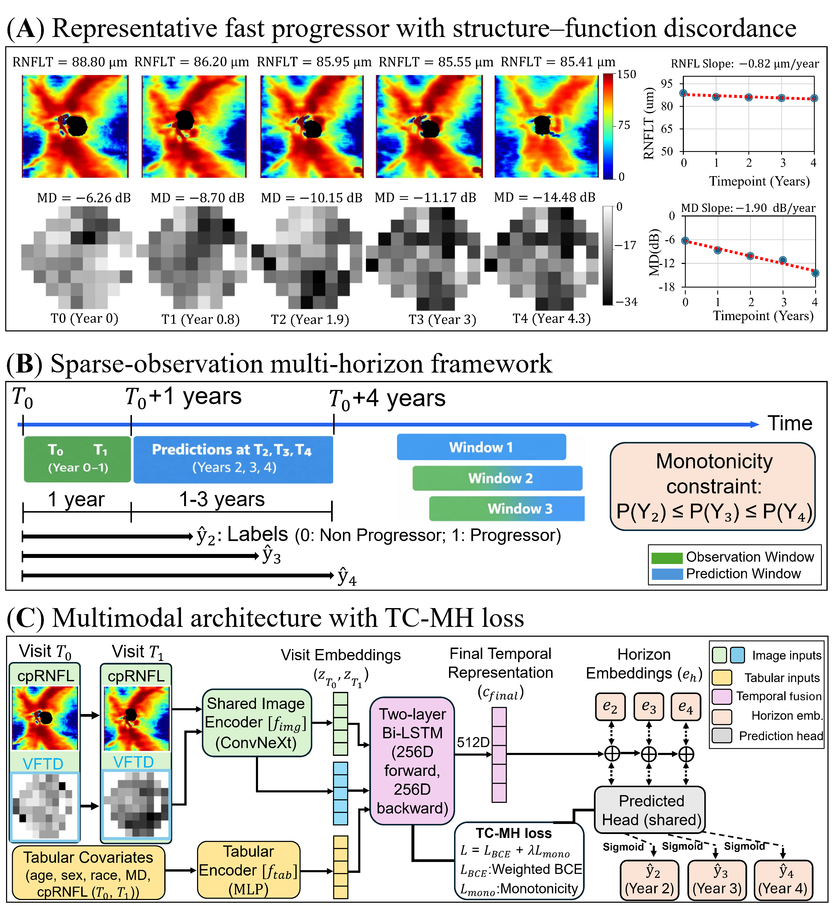
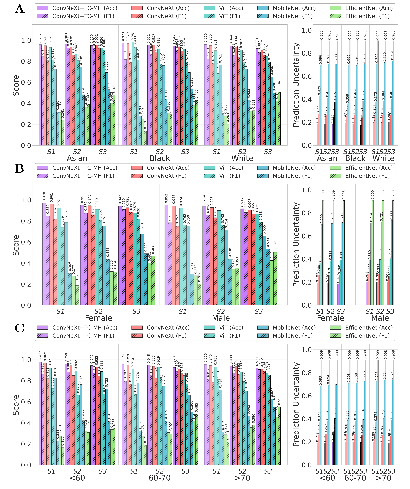

# Sparse-Observation Multi-Horizon Glaucoma Progression Prediction

Multimodal deep learning framework for forecasting glaucoma progression at **2, 3, and 4 years** from only **two clinical visits** (T₀, T₁ within a one-year observation window). The pipeline integrates circumpapillary retinal nerve fiber layer (cpRNFL) OCT thickness maps, visual field total-deviation (VF TD) plots, and clinical covariates, and introduces a **Temporally-Consistent Multi-Horizon (TC-MH) loss** that enforces monotone risk across prediction horizons.

<p align="center">
  
</p>

**Figure 1.** Study design. **(A)** A representative fast progressor showing structure–function discordance — near-flat cpRNFL slope (−0.82 μm/year) despite rapid MD decline (−1.90 dB/year) — motivating a multimodal approach. **(B)** Sparse-observation multi-horizon framework: two observed visits at T₀ and T₀+1 year predict progression labels at T₂, T₃, and T₄ (years 2, 3, 4), with a monotonicity constraint P(Y₂) ≤ P(Y₃) ≤ P(Y₄). **(C)** Multimodal architecture: a shared ConvNeXt-V2 image encoder embeds cpRNFL and VF TD at each visit, a tabular MLP encodes clinical covariates, a two-layer Bi-LSTM produces a temporal representation c_final, and a horizon-conditioned shared prediction head outputs three sigmoid probabilities. The **TC-MH loss** combines weighted BCE with a monotonicity penalty: `L = L_BCE + λ · L_mono`.

---

## Method summary

The framework has two contributions over standard multimodal Bi-LSTM baselines:

1. **Horizon-conditioned shared prediction head.** Instead of three independent output heads, a single shared head is conditioned on a learned horizon embedding (Y₂ / Y₃ / Y₄). This ties horizon-specific predictions to a common latent risk representation.

2. **Temporally-Consistent Multi-Horizon (TC-MH) loss.** A monotonicity penalty `L_mono = mean(ReLU(P_h − P_{h+1})²)` is added to the masked BCE loss, discouraging clinically implausible non-monotone risk trajectories (e.g. P(Y₂) > P(Y₃)).

The proposed model (`ConvNeXt-V2 + TC-MH`) is compared against four backbone baselines (ConvNeXt-V2, ViT-Base, MobileNet-V2, EfficientNet-B0) under **identical cohort, splits, and training hyperparameters**.

---

## Repository structure

```
.
├── data_preparation.py           # Step 1: match VF/cpRNFL, QC, MD-slope labels
├── sequence_generation.py        # Step 2: build (T0, T1) sparse-observation sequences
├── src/
│   └── Training_code/
│       ├── train_baseline.py     # Step 3a: ConvNeXt / ViT / MobileNet / EfficientNet
│       └── train_tcmh.py         # Step 3b: proposed ConvNeXt-V2 + TC-MH model
├── figures/                      # Study-design and results figures
├── requirements.txt
├── LICENSE
└── README.md
```

`train_baseline.py` and `train_tcmh.py` share the same dataset, cohort filter, patient-level `GroupKFold` cross-validation, tabular preprocessing, and optimizer schedule. The only differences between them are the model class and the loss, so any performance gain from TC-MH is attributable to the method — not to data or training-setup drift.

---

## Requirements

Python ≥ 3.10 with:

```
torch>=2.0
torchvision
timm
pandas
numpy
scikit-learn
Pillow
scipy
matplotlib
tqdm
```

Install:

```bash
pip install -r requirements.txt
```

---

## Input data

The pipeline expects longitudinal glaucoma records with, at minimum:

- `patient_id`, `eye`, `exam_date`
- `md` (mean deviation), `avg_rnfl` (mean cpRNFL thickness)

Optional columns used downstream:

- `false_positive_rate`, `signal_strength` — QC filters
- `age`, `sex`, `race` — tabular covariates
- `vfi`, `vf_progression`, `Severity`, `gl_subtype` — labels and stratification

Column names may need to be adjusted inside the scripts to match your dataset.

The repository does **not** ship patient data; access is subject to institutional review and data-sharing agreements.

---

## Step 1 — Data preparation

`data_preparation.py` matches VF and cpRNFL records by patient, eye, and date, applies QC filters, computes per-eye MD slope, and assigns progression categories.

```bash
python data_preparation.py \
    --vf_path   /path/to/vf_data.csv \
    --rnfl_path /path/to/rnfl_data.csv \
    --output_path prepared_data.csv
```

**Output.** `prepared_data.csv` — matched VF–cpRNFL visits with MD-slope-based progression labels.

---

## Step 2 — Sequence generation

`sequence_generation.py` converts prepared longitudinal records into sparse-observation sequences using two input visits (T₀, T₁) and assigns multi-horizon labels for years 2, 3, and 4. Sequences with partial follow-up are **retained** with missing horizons masked, rather than discarded.

```bash
python sequence_generation.py \
    --input_path  prepared_data.csv \
    --output_path sequences.csv
```

**Output.** `sequences.csv` containing per-sequence T₀/T₁ image paths, tabular covariates, and horizon labels `label_y2`, `label_y3`, `label_y4` (NaN where follow-up is unavailable).

---

## Step 3a — Baseline training

`src/Training_code/train_baseline.py` trains one of four multimodal Bi-LSTM baselines (shared-weight image encoder + tabular concatenation + three independent output heads) with masked multi-horizon BCE.

```bash
python src/Training_code/train_baseline.py \
    --sequences_path sequences.csv \
    --image_dir      /path/to/images \
    --backbone       convnext \
    --output_dir     ./results_baseline
```

**Supported backbones:** `convnext`, `vit`, `mobilenet`, `efficientnet`.

## Step 3b — Proposed TC-MH training

`src/Training_code/train_tcmh.py` trains the proposed ConvNeXt-V2 + TC-MH model with a horizon-conditioned shared head and masked TC-MH loss. All other components are identical to the baseline script.

```bash
python src/Training_code/train_tcmh.py \
    --sequences_path sequences.csv \
    --image_dir      /path/to/images \
    --output_dir     ./results_tcmh \
    --lambda_mono    0.5
```

**Output** (both scripts). Per-fold best checkpoints and a JSON summary of AUROC, accuracy, and F1 at each horizon.

---

## Results

<p align="center">
  
</p>

**Figure 2.** Subgroup performance and prediction uncertainty across demographic strata and severity subgroups (S1, S2, S3). Accuracy and F1 are reported for **(A)** race (Asian, Black, White), **(B)** sex (Female, Male), and **(C)** age (< 60, 60–70, > 70) across five model variants: **ConvNeXt + TC-MH** (proposed), ConvNeXt, ViT, MobileNet, and EfficientNet. The right column shows prediction uncertainty per subgroup. The proposed ConvNeXt + TC-MH model achieves the highest accuracy and F1 in nearly every subgroup–severity combination while maintaining consistently low uncertainty relative to baselines.

---

## Notes on reproducibility

- Patient-level `GroupKFold` cross-validation is used in both scripts to prevent eye-level and patient-level leakage across folds.
- Random seeds for Python, NumPy, and PyTorch are set at the start of each run.
- Missing images are replaced with zero tensors at load time; missing horizon labels are masked out of both the BCE and the monotonicity penalty.
- Tabular features are z-scored per fold using training-set statistics only.

---

## Data availability

The clinical dataset used in this study is not publicly available due to institutional privacy and data-sharing restrictions. Users should prepare their own dataset in the format described in **Input data** above.

---

## License

MIT License. See [`LICENSE`](LICENSE).

---

## Citation

If you use this code, please cite:

> Zebardast, Nazlee, Mousa Moradi, Jerry Cao-Xue, Asahi Fujita, Daniel Liebman, Alessandro Jammal, Mengyu Wang, Tobias Elze, and Mohammad Eslami. *"Sparse-Observation Multi-Horizon Glaucoma Progression Forecasting with Biologically Constrained Temporal Consistency: A Glaucoma Case Study." *(2026).

---

## Contact

Mousa Moradi: `mmoradi2@meei.harvard.edu`
Harvard Ophthalmology AI Lab, Schepens Eye Research Institute / Mass Eye and Ear / Harvard Medical School.
